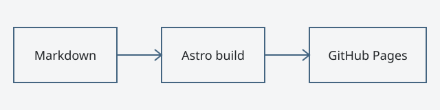

기록은 다시 읽을 수 있을 때 가치가 생깁니다. 이 글은 **삭제해도 되는 샘플**입니다.

## 문서가 먼저

페이지를 열면 글이 먼저 보이고, 링크를 누르면 다음 문서로 이동합니다.
복잡한 도구 없이도 읽을 수 있는 공간을 만들고 싶었습니다.

## 작게 시작하기

- Markdown으로 글을 씁니다.
- 이미지 원본은 글과 같은 폴더에 둡니다.
- 시리즈와 태그는 서로 다른 탐색 방법을 제공합니다.

```ts
const archive = ['기록', '배움', '일상'];
console.log(archive.join(' · '));
```

### 오래 유지하기

새로운 기능을 더하기 전에 지금의 코드가 읽기 쉬운지 먼저 살펴봅니다.

## 문서 확장 예제

:::callout{type="tip" title="샘플 콘텐츠 안내"}
이 글과 이미지는 검증용입니다. 내 글을 작성할 때 삭제하거나 바꿔도 됩니다.
:::

:::details{summary="접어서 보는 메모"}
HTML의 기본 기능으로 내용을 접습니다.

::::details{summary="중첩된 메모"}
안쪽 메모도 JavaScript 없이 열 수 있습니다.
::::
:::

:::figure{caption="Markdown에서 배포까지" credit="MayB"}

:::

::link-card{url="https://docs.astro.build/ko/" title="Astro 문서" description="Astro의 공식 한국어 가이드"}

::social{platform="github" url="https://github.com/zhdlxh48" label="GitHub에서 더 보기"}

::metric{label="예시 측정값: LCP" value="1.2" unit="s" status="good"}

::youtube{id="aqz-KE-bpKQ" title="Big Buck Bunny (샘플 영상)"}

## 이미지 크기 검증

다음 이미지는 서로 다른 원본 크기의 출력 검증에 사용하는 단순 패턴입니다.


